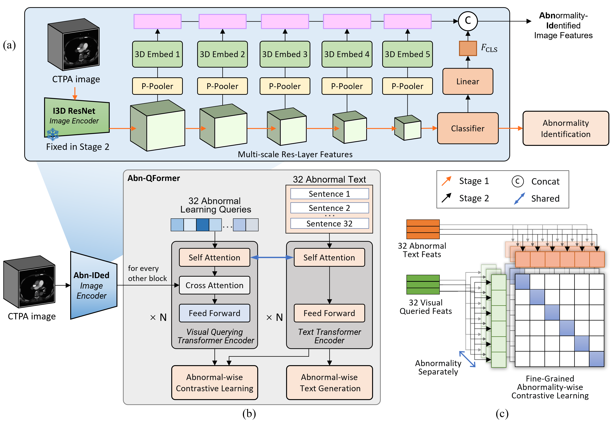

## Abn-BLIP: Abnormality-aligned Bootstrapping Language-Image Pre-training for Pulmonary Embolism Diagnosis and Report Generation from CTPA

[Paper Link](https://arxiv.org/abs/2503.02034)

Project implementation with:
 1. LAVIS: [LAVIS]

[LAVIS]:https://github.com/salesforce/LAVIS
[GatorTron]:https://huggingface.co/AshtonIsNotHere/GatorTron-OG

